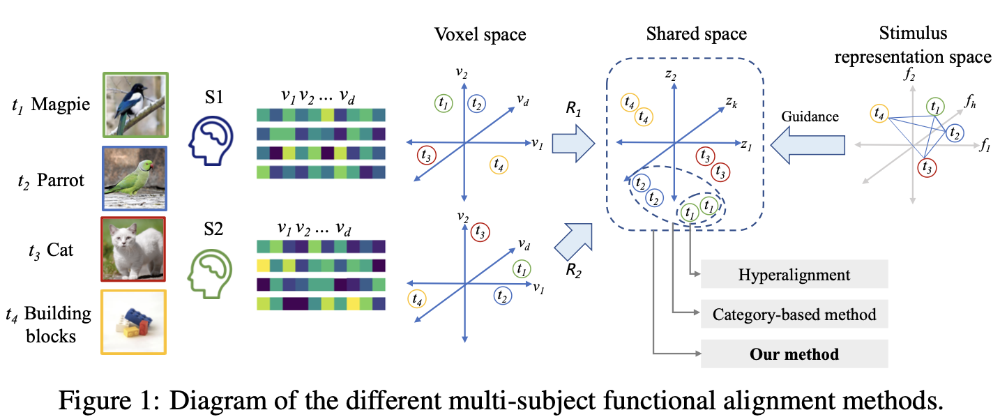
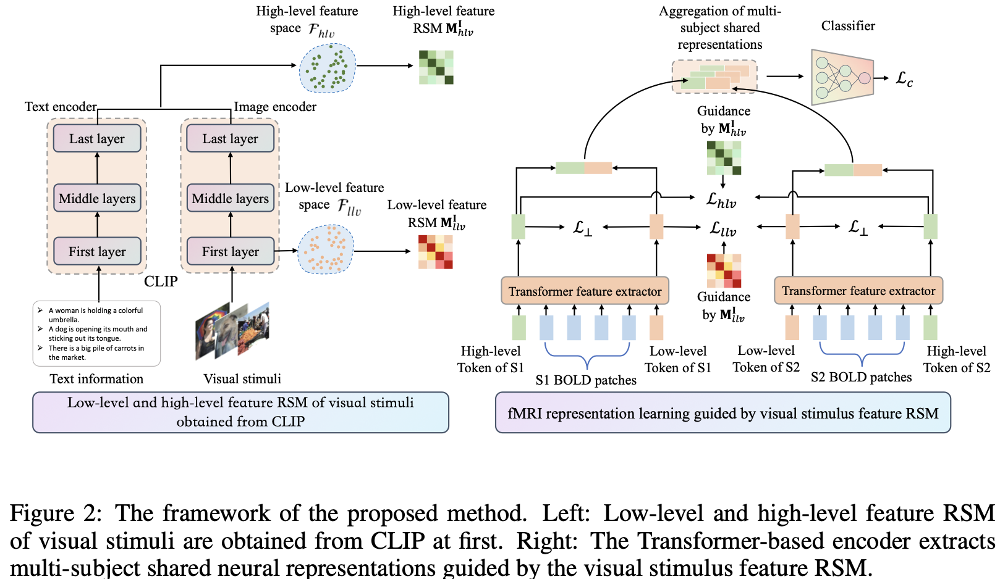
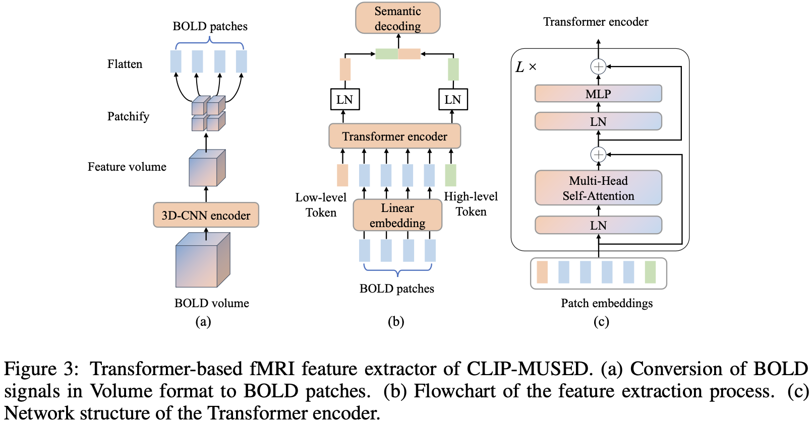
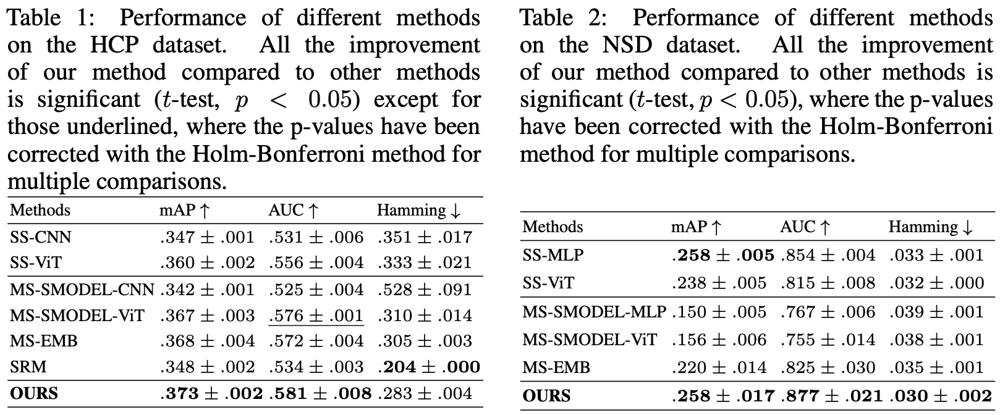
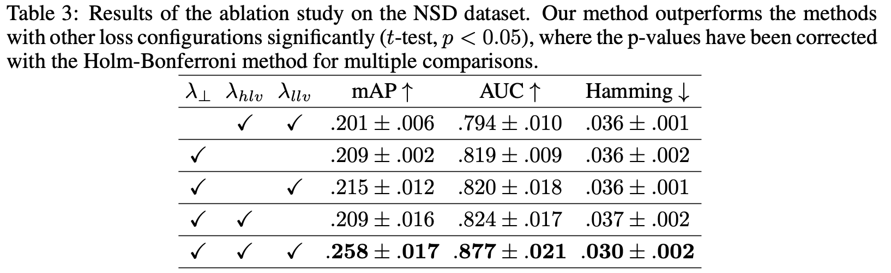
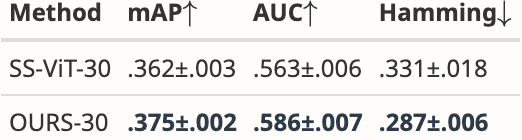
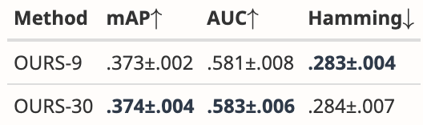
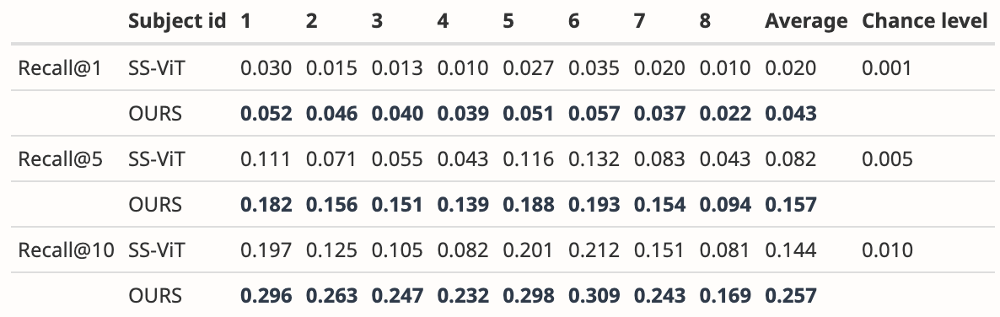

# CLIP-MUSED: 跨被试的图像脑解码

> **标题**: CLIP-MUSED: CLIP-Guided Multi-Subject Visual Neural Information Semantic
>
> **会议**: ICLR 2024

[TOC]

## 1. Abstract

- 解码视觉神经信息的研究面临着一个挑战, 即由于个体差异, 难以将单一受试者的解码模型推广应用到多个受试者.
- 此外, 单一受试者数据的有限可用性对模型性能产生了限制性影响.
- 尽管先前的多主体解码方法已取得显著进展, 但仍然存在一些限制, 包括提取全局神经反应特征的困难、模型参数随受试者数量线性增长, 以及对不同受试者对各种刺激的神经反应之间关系的描述不充分.
- 为了克服这些限制, 我们提出了一种**以 CLIP 为指导的多主体视觉神经信息语义解码 (CLIP-guided Multi-sUbject visual neural information SEmantic Decoding, CLIP-MUSED)** 方法.
- 我们的方法包括一个基于 Transformer 的特征提取器, 用以有效地建模全局神经表示.
- 它还融合了可学习的特定于受试者的令牌, 有助于汇集多主体数据, 而不会导致参数的线性增加.
- 此外, 我们采用**表征相似性分析 (representational similarity analysis, RSA)** 来指导基于 CLIP 表征空间中视觉刺激的拓扑关系的**令牌表征 (token representations)** 学习, 从而全面描述不同受试者在不同刺激下的神经反应之间的关系.
- 最后, 令牌表征用于多主体语义解码.
- 我们提出的方法优于单一受试者解码方法, 并在两个功能性磁共振成像 (fMRI) 数据集上的现有多主体方法中取得了最先进的性能.

## 2. Motivation & Contribution

### 2.1 Related Work

- **超对齐 (Hyperalignment)**
  - 将同一刺激的不同被试响应对齐. 如图的 $t_1$ 和 $t_1$ 对齐, $t_2$ 和 $t_2$ 对齐.
  - 无法处理: 不同的被试观看不同的刺激的场景.
- **基于类别的对齐 (Category-based method)**
  - 将同一刺激类别的不同被试响应对齐. 如图 $t_1$, $t_1$, $t_2$, $t_2$ 对齐. (这是两种不同的鸟, 但都属于鸟)

### 2.2 Motivation

现有的多被试解码方法仍然具有以下三个挑战:

- 上图中的 mapping function $R_i$ 限制了表达能力 (MLP不行, CNN也不行)
- 要为每个被试学习一个 $R_i$. 这意味着模型参数将是被试数量的 $O(n)$ 复杂度.
- 模型未充分利用刺激之间的相似性. 例如上图中, $t_1$ 和 $t_2$ 都是鸟, $t_3$ 是🐱, $t_4$ 是积木, 模型只考虑了 $t_1$ 和 $t_2$ 的相似性, 而真实的情况是: $t_3$ 和 $t_1, t_2$ 更有相关性, 因为都是动物, 而与无生命的 $t_4$ 相关性更低.

### 2.3 Contribution

- **提出新方法CLIP-MUSED**: 为解决上述问题, 提出了一种基于 CLIP 指导的多主体视觉神经信息语义解码方法 (CLIP-MUSED)
- **基于 Transformer 的特征提取器**: 提出采用 Transformer 架构的 fMRI 特征提取器来高效提取神经反应的全局特征.
- **学习个体差异标记**: 引入了低级和高级特征的个体差异标记, 通过表征相似性分析 (RSA) 和 CLIP 表征空间的拓扑关系指导这些标记的表示学习, 从而充分表征不同受试者在不同刺激下的神经表示关系.
- **实验结果**: 在两个 fMRI 数据集上的实验结果表明, CLIP-MUSED 能够通过聚合更多的训练数据并减少个体差异, 超越单主体解码方法, 达到现有多主体方法中的最先进性能.

## 3. Methodology

### 3.1 Overview

- 假设有 $N$ 个被试.
- 令 $\mathcal X^{(n)}$ 表示第 $n$ 个被试的 fMRI 体素空间.
- 令 $X^{(n)}\in\mathbb R^{n_i\times d_i}$ 表示第 $n$ 个被试的神经响应. 其中 $n_i$ 是图像刺激数, $d_i$ 是体素数.
- 令 $\mathcal I$ 表示图像刺激的像素空间. $\mathcal Y$ 表示图像刺激的标签空间. $\mathcal F$ 表示图像刺激的 CLIP 表示空间.
- 学习目标: 训练一个分类器 $C: \mathcal X^{(1)}\times\cdots\times\mathcal X^{(n)}\to\mathcal Y$. 为了达到这一目标, 我们:
  - 提出 CLIP-MUSED, 学习一个从图像刺激 $\mathcal I$ 到 CLIP 表示空间 $\mathcal F$ 的映射.
  - 使用一个 Transformer 特征提取器, 学习一个从神经响应 $\mathcal X^{(n)}$ 到共享空间 $\mathcal Z$ 的映射.
  - 采用表征相似性分析, 通过图像刺激 CLIP 表示空间 $\mathcal F$ 的拓扑关系, 引导共享空间 $\mathcal Z$ 的学习.

### 3.2 基于 CLIP 的视觉刺激特征提取

- 如图二左边所示.
- 文本描述来源: Caption / 类别名描述, 二者之一.
- **低级特征** $f_{llv}$: CLIP image encoder 的第一层特征.
- **高级特征** $f_{hlv}$: CLIP image encoder 和 CLIP text encoder 的最后一层特征的平均.
- 令 $B$ 表示 batch size.
- 计算 **表示相似度矩阵 (representation similarity matrices, RSMs)**: $M_{llv}^I$ 和 $M_{hlv}^I$, 以量化 $B$ 个视觉刺激之间的低级和高级特征空间之间的相似度. 其中, $M_{llv}^I[i, j]$ 表示第 $i$ 个和第 $j$ 个图像刺激的 $f_{llv}$ 之间的余弦相似度.

### 3.3 基于 Transformer 的 fMRI 特征提取

- 设 fMRI 体素数是 $d$, 则输入为 $x\in\mathbb R^d$.

- 将其 patchfy, patch size 为 $d_{in}$, 有 $M$ 个 patch. 则输入为 $x\in\mathbb R^{M\times d_{in}}$.

- 将 $x$ 通过线性 embedding 层 $E\in\mathbb R^{d_{in}\times d_{out}}$, 映射为 emebddings $z_0$, 公式化为:
  $$
  \begin{align}
  z_0&=[x_{llv};x_{hlv};x^1E;\cdots x^M E]+E_{pos}\\
  z'_l&=\text{MHSA}(\text{LN}(z_{l-1})) + z_{l-1} &&l=1, 2, \cdots, L\\
  z_l&=\text{MLP}(\text{LN}(z'_l))+z'_l &&l=1, 2, \cdots, L\\
  z_{llv}&=\text{LN}(z_L^0)\\
  z_{hlv}&=\text{LN}(z_L^1)
  \end{align}
  $$
  其中 $x_{llv}$ 和 $x_{hlv}$ 是低级特征和高级特征 token (可学习), $E_{pos}$ 是 position embedding.

  $L$ 是 Transformer 的层数.

### 3.4 多被试共享神经响应表示

- 用 3.2 中的方法, 对 $z_{llv}$ 和 $z_{hlv}$ 分别计算 $M_{llv}^X$, $M_{hlv}^X$.

- 注意, 不管是在 3.2 中还是这里, 所有被试被打乱来训练, 即 $z_{llv}[i]$ 和 $z_{llv}[j]$ 可能来自不同的被试.

- 损失函数: (均方 $F$ 范数)
  $$
  \begin{align}
  \mathcal L_{llv}&=\frac{1}{B^2}||M_{llv}^I-M_{llv}^X||^2_F\\
  \mathcal L_{hlv}&=\frac{1}{B^2}||M_{hlv}^I-M_{hlv}^X||^2_F
  \end{align}
  $$

### 3.5 语义分类器

- $z=[z_{llv};z_{hlv}]$

- $\hat y=\text{MLP}(z)$

- 损失函数:
  $$
  \mathcal L_c=-\frac{1}{C}\sum_{j=1}^C\left[
  y_j\log(\hat y_j)+(1-y_j)\log(1-\hat y_j)
  \right]
  $$

- 为了鼓励低层表示和高层表示描述的不同, 令两者表示尽量正交:
  $$
  \mathcal L_{\bot}=\frac{1}{B^2}||z_{llv}z_{hlv}^T||_F^2
  $$

## 4. Experiment

### 4.1 Datasets

- HCP
- NSD

### 4.2 对比实验

### 4.3 消融实验

## 5. 公开审稿信息

- **Soundness**: 3 good, 3 good, 3 good.
- **Presentation**: 3 good, 2 fair, 3 good.
- **Contribution**: 3 good, 2 fair, 3 good.
- **Rating**: **8** (accept, good paper), **6** (marginally above the acceptance threshold), **5** (marginally below the acceptance threshold), 

### 5.1 官方审稿人 mWYc

- **Summary**: 本文针对多主体视觉刺激反应对齐的问题, 这对视觉神经解码任务而言十分重要. 通常, 视觉神经解码任务的模型要么针对单一受试者训练 (可能导致过拟合等问题), 要么需校正不同受试者大脑的解剖结构和功能拓扑差异. 文章提出了一种超越现有技术水平 (如超对齐和基于类别的方法) 的新型多主体功能对齐方法. 该方法利用基于 Transformer 的模型来捕获大脑区域间功能连接的长距离依赖性. 通过额外的特定于受试者的标记来模拟受试者间的差异, 并使用 CLIP 表征空间来实现视觉刺激的皮层表征之间的高度一致性.

- **Strengths**: 本文解决了神经科学领域中一个重要问题, 并提出了一种新颖有趣的多主体对齐方法. 使用 Transformer 模型来表征大脑区域间的长距离关联, 以及运用 CLIP 表征空间指导共享表征空间中的神经表示学习, 是一个很好的想法! 尽管在两个 fMRI 数据集上的实验结果受限于数据规模较小, 但很好地证明了这一概念.

- **Weakness**: 我发现摘要的表述不如引言清晰. 从摘要中看不清楚这篇文章的目标以及实现方式. 引言部分则做得更好. 或许作者可以尝试更清楚地阐述所解决的问题和贡献 (我理解在有限的空间里做到这一点较为困难). 评估相对有限, 特别是因为数据集的规模较小.

- **Question 1**: 为什么分开提取低级特征和高级特征?

  **Answer**: 物体分类任务需要编码刺激的低级和高级特征, 并且不同受试者在编码这两类特征上存在差异. 因此, 我们引入了低级和高级标记来考虑这些差异. 为了鼓励这些标记编码低级和高级特征, 我们利用了 CLIP 中低级和高级特征的指导, 这需要两个特征表征相似性矩阵 (RSM). 此外, 分别提取低级和高级特征 RSM 有两个优点:

  1. 刺激在低级特征 (例如, 形状、颜色) 空间和高级特征 (例如, 语义) 空间的拓扑结构表现出差异. 通过在两个 RSM 中编码不同的拓扑结构并结合标记的正交约束, 有助于标记学习更好的表示.
  2. 通过可视化注意力图, 我们可以观察到初级脑区与低级标记之间的对应关系, 以及高级脑区与高级标记之间的对应关系, 从而确保算法的可解释性.

- **Question 2**: HCP 数据集包含超过158名受试者. 为什么没有使用所有受试者? 这158名受试者是如何从 HCP 中选出的? 随机选取的吗? 为什么进一步减少到9人? 这里的瓶颈是什么?

  **Answer**: 首先, 我们想澄清, 我们提出的算法本身并不是瓶颈. 我们的方法可以轻松扩展到更多受试者, 因为在增加一个受试者进行训练时, 模型只需要学习额外两个 $N$ 维向量, 其中 $N$ 等于 512. 我们选择了和文献 [3] 相同的十名受试者, 文献 [3] 是随机选取十名受试者进行实验的. 然而, 其中一名受试者的数据格式存在问题. 因此, 我们使用剩余的九名受试者继续进行实验.

  虽然算法本身并非瓶颈, 但增加受试者数量和训练数据可能会延长训练时间并需要额外的资源. 考虑到 HCP 数据集中不同受试者面对的刺激是相同的, 数据多样性相较于 NSD 数据集更为有限. 当受试者数量达到一定阈值时, 相当于用更多迭代次数训练模型, 因为模型重复处理不同受试者在相同刺激下的类似反应. 因此, 同时训练所有158名受试者可能不会显著提高单个受试者的解码性能, 但会要求更多的训练资源. 因此, 我们目前仅对九名受试者进行了实验.

  为了展示我们的方法对更多受试者的广泛适用性, 我们目前正在进行30名受试者的多主体解码实验, 并将尽快提供实验结果的更新.

  [3] Khosla et., al.(2020) A shared neural encoding model for the prediction of subject-specific fMRI response. MICCAI.

  实验结果:

  

  

### 5.2 官方审稿人 qr5q

- **Summary**: 作者提出了一种基于 Transformer 的跨受试者 fMRI 对齐方法, 该方法使用学习到的特殊标记 (这种方法也被应用于其他进行分类的视觉 Transformer/语言工作).

  具体来说, 论文讨论了传统超对齐方法中的以下问题:

  1. 映射函数的限制性 (假设是指正交、线性映射或核化映射).
  2. 每个受试者都需要一个映射函数, 当使用深度网络时可能代价昂贵.
  3. 需要相同的刺激或来自同一语义类别的刺激.

  他们提出了以下方法:

  1. 使用 Transformer 来建模长距离依赖关系.
  2. 使用特殊标记来建模受试者间的信息.
  3. 利用 CLIP 距离指导模型, 使用文本和视觉分支的平均值来表示高级特征.

- **Strengths**: CLIP-MUSED 是一种有趣的方法, 它共享模型参数, 只改变每个受试者的特定标记. 使用 CLIP 进行特征提取和特征对齐是稳固的. 该方法允许使用多主体数据而不会导致模型参数数量线性增加, 这对可扩展性有益. 文章提供了一个详细的方法部分, 涵盖了 CLIP-MUSED 的技术方面, 包括使用 Transformers 和 CLIP 以及基于 RSA 的损失设计. 高层次的方法论是清晰的. 文章组织得当, 使得跟随论点和理解方法论相对容易.

- **Weakness**:

  - 作者进行的相对较弱的解码工作, 似乎仅限于类别解码. 对我来说非常奇怪的是, 他们相对于传统方法使用了如此多的计算资源, 最终只进行了类别解码. 我认为如果能够执行视觉解码, 以完整图像重建的形式进行, 至少对于 NSD (单图像被动观看任务) 来说, 结果会更有力. 如果这不可能, 我认为另一种选择是在测试集上进行图像检索 (展示前5张), 其中测试集包含未用于任何受试者训练的图像. 这可能需要仅在单个受试者的刺激上训练解码器, 然后在其他受试者上进行测试.

    **Reply**: 感谢您宝贵的建议. 我们正在补充进行检索实验, 实验结果将在完成后尽快发布. 尽管重建任务也具有重要的研究价值, 但重建涉及到如扩散模型等深度生成模型, 而我们的方法是一种判别模型. 关于重建任务的算法研究超出了本文的范围. 我们将考虑在未来进行进一步的研究.

    实验结果:

    

  - 另外, 受试者特定的标记不是通过摊销推理 (通过编码器, 基于少量 BOLD 响应) 计算的, 而是固定的. 在我看来, 这在某种程度上削弱了方法的效力, 因为你不能将这种方法应用于新受试者, 并以少数样本的方式进行, 尽管论文中提到了他们的方法不需要受试者观看相同的刺激.

    **Reply**: 您提到的摊销推理确实是一个好主意, 但我们的方法与摊销推理相比也有其优势.

    1. 摊销推理通常依赖于对先验分布的假设. 如果先验假设不当或不准确, 可能会影响推理的有效性和结果的质量. 而我们的方法不依赖于先验分布假设.
    2. 我们的方法消除了对编码网络的需求, 减少了需要学习的参数数量, 从而防止过拟合.

    在多主体神经解码领域, 以少数样本方式应用于新受试者仍是一个共同面临的挑战. 我们已尽可能地减少了新受试者需要学习的参数.

- **Question 1**: 🦆 Ducks should be birds.

  **Answer**: 把 🦆 的图片换成 🐱.

- **Question 2**: 原文说 `Linear transformation and MLP are unsuitable for high-dimensional voxel responses.` 但没有给出理由.

  **Answer**: 首先, 我们讨论了线性变换不适用于高维体素反应的原因, 因为在他们的论文中, Yousefnezhad 等人指出, "原始的超对齐在非常高维的空间中不起作用". 其次, 由于多层感知器 (MLP) 是由堆叠的线性层和激活函数组成的, 因此在 Yousenezhad 和 Zhang 的研究中提到的多层核函数将会有大量的参数. 基于此, 基于 MLP 的方法不是一种参数高效的方法, 且不适合高维数据. 

- **Question 3**: 网络的 backbone 不明确.

  **Answer**: 现在的论文已修正.

- **Question 4**: 预测的 label 具体是什么不明确.

  **Answer**: 在 HCP 数据集中, 我们使用 WordNet 标签作为刺激图像的语义标签. WordNet 中的每个词被视为一个独立的类别或类. 在 NSD 中, 刺激图像标签分为 80 个类别. 在 HCP 和 NSD 中, “1”表示某个类别的存在, 而“0”表示其不存在. 一个单一的刺激图像可能与多个标签相关联.

